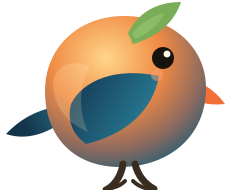

# Bird Companion

[English](#english) | [中文](#中文)

<p align="center">
  
</p>

## English

Bird Companion is a tiny always-on-top desktop bird that reacts to your typing rhythm with bird calls, motion, and lightweight typing stats. It is built as an Electron desktop pet rather than a browser page, so it can sit on your desktop, be dragged around, and optionally listen for global keyboard activity.

### Highlights

- Desktop pet window with transparent, frameless, always-on-top behavior.
- Bird calls driven by typing rhythm, with mute, volume, and feedback-frequency controls.
- Feedback frequency modes: `1`, `3`, or `5` keys per bird-call response.
- Persistent total key counter, daily stats, and per-key aggregate counts.
- Optional global listening for cross-app typing feedback.
- Automatic facing direction: the bird looks inward from the left or right side of the screen.
- English/Chinese interface toggle. English is the default.

### Install

Recommended for Windows:

1. Open the latest [GitHub Release](https://github.com/Electro-Dig/bird-companion/releases/latest).
2. Download `Bird.Companion.Setup.0.2.3.exe`.
3. Run the installer. It creates Start Menu and desktop shortcuts for Bird Companion.

macOS local testing:

1. Clone the repo on an Apple Silicon Mac.
2. Run `npm install && npm run dist:mac:zip`.
3. Open `dist/mac-arm64/Bird Companion.app` directly, or unzip `dist/Bird.Companion.mac-arm64.0.2.3.zip`.

Other channels:

- Source run: clone the repo and run `npm install && npm start`. This avoids an installer, but it downloads Electron through npm.
- Mac test build: maintainers can run `npm run dist:mac` to create unsigned local-testing `dmg` and `zip` builds for Apple Silicon Macs.
- Portable build: maintainers can run `npm run dist:win:portable` to create `Bird.Companion.Portable.0.2.3.exe`, a no-install Windows executable for GitHub Releases. It is usually smaller than the installer.
- Zip build: maintainers can run `npm run dist:win:zip` to publish `Bird.Companion.0.2.3.zip`, an unpack-and-run archive. It is usually larger than the installer, but it can feel more transparent.

Package-size note: Bird Companion is currently Electron-based, so every desktop build includes Chromium and Node. `v0.2.3` keeps only English/Chinese Electron locales and excludes unused spectrogram PNGs from packaged builds. A substantially smaller build would likely require a future Tauri/WebView2 rewrite.

Developer install:

Requirements:

- Windows 10/11
- macOS on Apple Silicon for the current Mac test build
- Node.js 20+

```sh
git clone https://github.com/Electro-Dig/bird-companion.git
cd bird-companion
npm install
npm start
```

You can also run the helper script after dependencies are installed:

```powershell
.\start-bird-companion.cmd
```

### Use

- Drag the bird window to place it on the desktop.
- Hover the bird to reveal the controls and detail panels.
- Press `M` to mute/unmute.
- `G` is enabled by default for global keyboard listening. Press it to turn global listening off.
- Press `中` / `EN` to switch language.
- Press `?` to open the quick guide.
- Press `♡` to support the maker.
- Use the `1 / 3 / 5` segmented control to choose how often typing triggers bird calls.
- Drag the volume slider to adjust overall bird-call volume.
- Press the `keys` badge or the small detail button beside it to open the compact typing detail card.
- Press `More` on the current sound card to open the original xeno-canto recording page in your browser.

The visible key badge shows your saved total key count. The detail card shows total keys, today's keys, session keys, current keys per second, a compact QWERTY heatmap, and top keys for the selected date. If global listening is off, only focused-window typing is counted. If global listening is on, cross-app typing can be counted while the app is running.

### Privacy

Bird Companion counts typing events but does not store typed text, typed order, window titles, or app names. Persistent local storage keeps aggregate counts only: total keys, per-key counts, per-day counts, language, bird style, and sound settings. The app uses Electron local storage inside its user data folder.

### Project Structure

```text
bird-companion/
  data/                  Bird-call metadata and bundled assets
  docs/                  Design notes, research, and roadmap
  src/main/              Electron main process and global keyboard bridge
  src/renderer/          Desktop pet UI, mascot, animation, audio logic
  tests/                 Node-based unit and smoke-oriented tests
```

### For Codex / Agent Maintainers

This repository is intentionally small and agent-friendly. Start here:

- App entry: `src/main/main.cjs`
- Global keyboard bridge: `src/main/global-key-events.mjs`
- Renderer entry: `src/renderer/index.html`
- UI orchestration: `src/renderer/companion.mjs`
- Sound mapping: `src/renderer/feedback-engine.mjs`
- Typing aggregates: `src/renderer/typing-stats.mjs`
- UI settings: `src/renderer/settings.mjs`
- Copy/i18n: `src/renderer/i18n.mjs`
- Roadmap and design notes: `docs/`

Important constraints for future agents:

- Do not store raw typed text or event sequences.
- Keep global listening opt-in and visibly controllable.
- Keep the default UI small; put deeper stats behind compact popovers.
- Prefer tests for every data-shape change in `tests/`.
- Run `npm test` and `npm run smoke` before claiming a change works.

### Development

```powershell
npm test
npm run smoke
npm run dist:mac:zip
npm run dist:win
```

`npm test` verifies the sound engine, global key translation, mascot style state, i18n copy, settings, window orientation, and typing stats. `npm run smoke` opens Electron in smoke-test mode and verifies the renderer boots successfully. `npm run dist:mac:zip` builds an unsigned Apple Silicon macOS zip for local testing in `dist/`. `npm run dist:mac` builds both macOS `dmg` and `zip` targets. `npm run dist:win` builds the Windows installer in `dist/`. `npm run dist:win:portable` and `npm run dist:win:zip` build no-install alternatives for maintainers.

### Roadmap

Possible next directions are collected in [docs/ROADMAP.md](docs/ROADMAP.md). Short version:

- richer bird action rig: wing flaps, beak-open chirps, hops, sleep, attention, and idle loops;
- packaged Windows release with installer and auto-start options;
- daily typing summaries and reset controls;
- more sound personalities and call-bank selection;
- optional Pomodoro/focus modes driven by typing rhythm;
- mascot skin system based on higher-quality sprite or vector rigs.

### Releases

GitHub releases use semantic tags such as `v0.2.3`. Current source version is tracked in `package.json`.

### Support

If you like this app, you are welcome to support the maker:

<p>
  
</p>

### Audio Credits

The bundled bird calls are derived from xeno-canto recordings listed in `data/samples-data.js`. Each sample keeps its xeno-canto ID, source URL, recordist, license, and recording metadata. When a call is active, the desktop card shows a `More` button that opens the original xeno-canto page for that recording. Most bundled recordings use Creative Commons BY-NC-SA 4.0, so sound assets are for non-commercial use unless the original recordist grants other rights.

### License

See [LICENSE.md](LICENSE.md) and [THIRD_PARTY_NOTICES.md](THIRD_PARTY_NOTICES.md).

## 中文

Bird Companion 是一个常驻桌面的小鸟宠物。它会根据键盘输入节奏发出鸟叫、做出动作反馈，并展示轻量的打字统计。它不是浏览器页面，而是一个 Electron 桌面应用，所以可以悬浮在桌面、拖动摆放，也可以选择开启全局键盘监听。

### 亮点

- 透明、无边框、始终置顶的桌面宠物窗口。
- 根据打字节奏触发鸟叫、动画和视觉反馈。
- 支持静音、整体音量、反馈频率调整。
- 反馈频率支持每 `1`、`3`、`5` 次按键触发一次鸟叫。
- 默认显示累计按键次数，支持每日统计和按键分布聚合。
- 支持可选的全局键盘监听，用于其他软件中的打字反馈。
- 自动判断朝向：放在屏幕左侧时朝右，放在右侧时朝左。
- 支持中英文界面切换，默认英文。

### 安装

Windows 推荐安装方式：

1. 打开最新的 [GitHub Release](https://github.com/Electro-Dig/bird-companion/releases/latest)。
2. 下载 `Bird.Companion.Setup.0.2.3.exe`。
3. 运行安装包。安装后会创建开始菜单和桌面快捷方式。

macOS 本机测试方式：

1. 在 Apple Silicon Mac 上克隆仓库。
2. 执行 `npm install && npm run dist:mac:zip`。
3. 直接打开 `dist/mac-arm64/Bird Companion.app`，或解压 `dist/Bird.Companion.mac-arm64.0.2.3.zip` 后运行。

其他分发方式：

- 源码运行：克隆仓库后执行 `npm install && npm start`。这不需要运行安装包，但会通过 npm 下载 Electron。
- Mac 测试构建：维护者可以执行 `npm run dist:mac`，为 Apple Silicon Mac 生成未签名的本地测试 `dmg` 和 `zip`。
- 便携版：维护者可以执行 `npm run dist:win:portable`，生成 `Bird.Companion.Portable.0.2.3.exe`，这是无需安装的 Windows 可执行文件，通常会比安装包更小。
- Zip 版：维护者可以执行 `npm run dist:win:zip`，发布 `Bird.Companion.0.2.3.zip` 解压即用压缩包。它通常比安装包更大，但对用户来说更透明。

体积说明：Bird Companion 目前基于 Electron，所以桌面构建会自带 Chromium 和 Node。`v0.2.3` 只保留英文/中文 Electron 语言包，并从打包产物中排除了当前桌面宠物界面未使用的频谱图 PNG。若要显著缩小体积，后续大概率需要改为 Tauri 或 WebView2 版本。

开发者安装方式：

环境要求：

- Windows 10/11
- 当前 Mac 测试构建需要 Apple Silicon macOS
- Node.js 20+

```sh
git clone https://github.com/Electro-Dig/bird-companion.git
cd bird-companion
npm install
npm start
```

依赖安装完成后，也可以运行启动脚本：

```powershell
.\start-bird-companion.cmd
```

### 使用

- 拖动小鸟窗口，把它放在桌面合适的位置。
- 鼠标悬停在小鸟身上，会显示控制按钮和信息面板。
- 点击 `M` 静音/取消静音。
- `G` 默认开启，用于全局键盘监听；点击它可以关闭。
- 点击 `中` / `EN` 切换语言。
- 点击 `?` 查看使用指南。
- 点击 `♡` 支持参与者。
- 用 `1 / 3 / 5` 分段按钮选择鸟叫反馈频率。
- 拖动音量条调整整体鸟叫音量。
- 点击 `keys` 徽章或旁边的小按钮，打开紧凑的按键统计卡片。
- 点击当前声音卡片上的 `更多`，可以在浏览器中打开对应 xeno-canto 原始录音页面。

默认可见的小徽章显示累计按键次数。统计卡片显示累计按键、今日按键、本次按键、当前每秒按键数、紧凑 QWERTY 热区和所选日期的高频按键。如果没有开启全局监听，只有应用窗口获得焦点时才会计数和反馈；开启全局监听后，应用运行期间可以统计其他软件中的键盘输入。

### 隐私

Bird Companion 只统计按键事件，不保存具体输入文本、输入顺序、窗口标题或应用名称。本地持久化只保存聚合数据：累计按键、按键分布、每日计数、语言、小鸟形象和声音设置。桌面端使用 Electron 本地存储，数据保存在本机用户数据目录。

### 项目结构

```text
bird-companion/
  data/                  鸟叫元数据和内置声音资源
  docs/                  设计记录、调研和路线图
  src/main/              Electron 主进程和全局键盘桥接
  src/renderer/          桌面宠物 UI、小鸟形象、动画和音频逻辑
  tests/                 Node 单元测试和 smoke 测试
```

### 给 Codex / Agent 维护者

这个仓库刻意保持小而清晰，方便 Codex 或类似 agent 接手。优先查看：

- 应用入口：`src/main/main.cjs`
- 全局键盘桥接：`src/main/global-key-events.mjs`
- 渲染入口：`src/renderer/index.html`
- UI 编排：`src/renderer/companion.mjs`
- 声音映射：`src/renderer/feedback-engine.mjs`
- 打字聚合：`src/renderer/typing-stats.mjs`
- UI 设置：`src/renderer/settings.mjs`
- 文案/i18n：`src/renderer/i18n.mjs`
- 路线图和设计记录：`docs/`

后续 agent 需要遵守：

- 不保存原始输入文本或输入序列。
- 全局监听必须保持可见、可关闭、默认由用户选择。
- 默认 UI 保持小尺寸，复杂统计放进紧凑浮窗。
- 数据结构变化要优先补 `tests/`。
- 声称完成前必须跑 `npm test` 和 `npm run smoke`。

### 开发

```powershell
npm test
npm run smoke
npm run dist:mac:zip
npm run dist:win
```

`npm test` 会检查声音引擎、全局按键转换、小鸟形象状态、国际化文案、设置、窗口朝向和打字统计。`npm run smoke` 会以 smoke-test 模式打开 Electron，确认渲染进程可以正常启动。`npm run dist:mac:zip` 会在 `dist/` 里生成未签名的 Apple Silicon macOS 本机测试 zip。`npm run dist:mac` 会同时生成 macOS `dmg` 和 `zip`。`npm run dist:win` 会生成 Windows 安装包。`npm run dist:win:portable` 和 `npm run dist:win:zip` 可以给维护者生成无需安装的替代分发版本。

### 后续方向

更完整的规划见 [docs/ROADMAP.md](docs/ROADMAP.md)。核心方向包括：

- 更成熟的小鸟动作骨架：扇翅、张嘴鸣叫、跳跃、睡眠、注意力、待机循环；
- Windows 安装包、开机启动和托盘控制；
- 每日打字总结、重置按钮和长期统计；
- 更多声音人格和鸟叫库选择；
- 基于输入节奏的番茄钟/专注模式；
- 基于高质量 sprite 或 vector rig 的小鸟皮肤系统。

### Release

GitHub release 使用 `v0.2.3` 这样的语义化 tag。当前源码版本记录在 `package.json`。

### 给我一杯咖啡

如果你喜欢这个应用，欢迎支持创作者：

<p>
  
</p>

### 声音来源

内置鸟叫来自 `data/samples-data.js` 中列出的 xeno-canto 录音。每条声音都保留了 xeno-canto ID、来源链接、录音者、授权和录音元数据。当某条声音被触发时，桌面声音卡片会显示 `更多` 按钮，点击后会打开对应的 xeno-canto 原始录音页面。多数内置录音使用 Creative Commons BY-NC-SA 4.0，因此声音资源默认只适合非商业用途，除非原录音者另行授权。

### 许可证

见 [LICENSE.md](LICENSE.md) 和 [THIRD_PARTY_NOTICES.md](THIRD_PARTY_NOTICES.md)。
